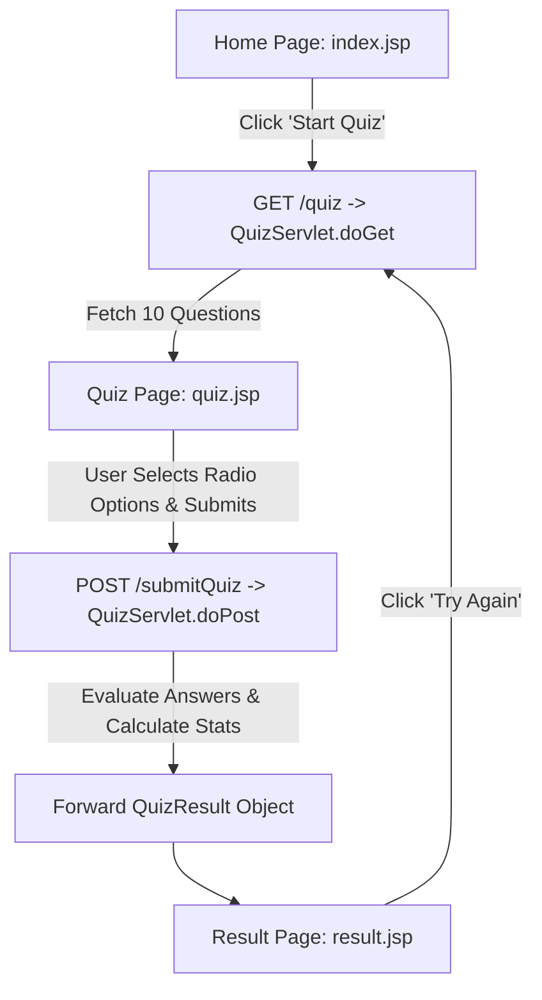

# Online Quiz System 📝

A simple, modern, and professional **Online Quiz System** web application built purely with **Java, Servlets, JSP, HTML, and CSS**, deployed on **Apache Tomcat**. 

This project is specifically designed to be beginner-friendly, clean, deployment-ready, and easy to explain during technical interviews.

---

## 📌 Project Overview

The **Online Quiz System** allows students and learners to test their technical knowledge by completing a 10-question multiple-choice quiz. The application evaluates answers in real-time on the server side using Java Servlets, calculates scores and percentages, and presents a detailed performance summary on the result page.

### Key Highlights:
- 🚫 **No external framework used** (No Spring Boot, React, Node.js, Django, or Bootstrap).
- 🚫 **No external database required** (Questions are stored cleanly in-memory using Java objects).
- 🎨 **Modern White & Dark-Blue UI** with responsive card-based layout.
- ⚡ **Pure Java Servlet & JSP** architecture following standard MVC principles.
- ☁️ **Cloud Deployment Ready** (Includes `Dockerfile` & Maven WAR configuration for instant cloud hosting).

---

## 🛠️ Technologies Used

| Technology | Purpose |
| :--- | :--- |
| **Java (JDK 8+)** | Core backend programming language & quiz evaluation logic |
| **Java Servlets (`javax.servlet`)** | Server-side request handling & routing (`QuizServlet.java`) |
| **JavaServer Pages (JSP)** | Dynamic UI rendering (`index.jsp`, `quiz.jsp`, `result.jsp`) |
| **HTML5** | Page structure & semantic form elements |
| **CSS3** | Custom styling, glassmorphism, responsive cards & button effects |
| **Apache Tomcat (v8.5 / v9 / v10)** | Web application container & HTTP web server |
| **Maven & Docker** | Build tool and cloud container configuration |

---

## 🌟 Features

1. **Home Page (`index.jsp`)**:
   - Clean welcome landing card with quiz guidelines.
   - "Start Quiz" action button.

2. **Quiz Page (`quiz.jsp`)**:
   - Displays 10 multiple-choice questions dynamically.
   - Each question has 4 options with customized styled radio buttons.
   - Shows progress indicators (e.g. `Question 1 of 10`).

3. **Backend Logic (`QuizServlet.java` & Models)**:
   - Stores questions using Java Collections (`List<Question>`).
   - Receives form data via `POST` request.
   - Compares selected options against correct answers.
   - Computes total score, percentage, correct count, and wrong count.
   - Assigns dynamic performance feedback based on score.

4. **Result Page (`result.jsp`)**:
   - Displays Total Questions, Correct Answers, Wrong Answers, Final Score, and Percentage.
   - Animated visual percentage progress bar.
   - Dynamic encouraging message based on performance.
   - "Try Again" button to restart the quiz.

---

## 📂 Project Folder Structure

```text
online-quiz-system/
├── pom.xml                               # Maven Project Descriptor
├── Dockerfile                            # Cloud Container Build Descriptor (Tomcat 9)
├── .dockerignore                         # Docker Build Exclusion Rules
├── README.md                             # Project Documentation & Deployment Guide
├── target/
│   └── online-quiz-system.war            # Compiled Deployable WAR Archive
└── src/
    └── main/
        ├── java/
        │   └── com/
        │       └── quiz/
        │           ├── model/
        │           │   ├── Question.java      # Model class representing a single Question
        │           │   └── QuizResult.java    # Model class representing Quiz Results
        │           ├── repository/
        │           │   └── QuestionRepository.java  # In-memory question data provider
        │           └── servlet/
        │               └── QuizServlet.java   # Controller Servlet handling GET & POST requests
        └── webapp/
            ├── css/
            │   └── style.css                 # Custom Responsive CSS Stylesheet
            ├── WEB-INF/
            │   └── web.xml                   # Deployment Descriptor (Servlet Mappings)
            ├── index.jsp                     # Home Landing Page
            ├── quiz.jsp                      # Quiz Form Page (10 Questions)
            └── result.jsp                    # Score & Metrics Result Page
```

---

## 🔄 Project Workflow



---

## 🚀 Execution & Deployment Guide

### 1. Local Development Instructions

#### Option A: Running via Eclipse IDE or IntelliJ IDEA
1. Open your IDE and select **Import Existing Maven Project** or **Dynamic Web Project**.
2. Select the project directory (`online quiz system`).
3. Configure your local **Apache Tomcat Server** (v8.5, v9, or v10).
4. Right-click on the project -> **Run As** -> **Run on Server**.
5. Open your browser and navigate to:
   ```text
   http://localhost:8080/online-quiz-system/
   ```

#### Option B: Running via Local Apache Tomcat Standalone
1. Copy the generated `online-quiz-system.war` file from `target/` into your local Tomcat's `webapps/` folder (e.g., `C:\apache-tomcat\webapps\`).
2. Start Tomcat using `bin/startup.bat` (Windows) or `bin/startup.sh` (Linux/Mac).
3. Open your browser at `http://localhost:8080/online-quiz-system/`.

---

### 2. Maven WAR Build Instructions

To compile all Java classes and build the `.war` package from the command line:

1. Open a terminal/command prompt in the root project folder.
2. Run the Maven packaging command:
   ```bash
   mvn clean package
   ```
3. The compiled deployable web archive will be generated at:
   ```text
   target/online-quiz-system.war
   ```

*(Note: The project is already compiled and `target/online-quiz-system.war` is generated).*

---

### 3. Cloud Deployment Instructions (Getting a Public HTTPS Web Link)

To share your quiz application with anyone on the internet, deploy it using a free cloud hosting platform like **Render** or **Railway**.

#### Recommended Platform: Render.com (Free Web Service)

**Step 1: Push your project to GitHub**
1. Create a free account on [GitHub.com](https://github.com).
2. Create a new public repository named `online-quiz-system`.
3. Open terminal in the project folder and push your code to GitHub:
   ```bash
   git init
   git add .
   git commit -m "Initial commit - Online Quiz System"
   git branch -M main
   git remote add origin https://github.com/YOUR_USERNAME/online-quiz-system.git
   git push -u origin main
   ```

**Step 2: Deploy on Render**
1. Create a free account on [Render.com](https://render.com).
2. Click **New +** -> Select **Web Service**.
3. Connect your GitHub account and select your `online-quiz-system` repository.
4. Fill in the deployment details:
   - **Name**: `online-quiz-system`
   - **Environment / Runtime**: **Docker** (Render will automatically detect the included `Dockerfile`).
   - **Plan**: **Free**.
5. Click **Create Web Service**.
6. Render will automatically build the Maven project inside Tomcat and deploy your application.

---

### 4. How to Access the Final Public URL

Once the deployment process completes on Render (usually takes 1-2 minutes):
1. Render will display your live project dashboard with a green **Deployed** status badge.
2. At the top left of your Render dashboard, you will see your unique **Public HTTPS Web Link**, for example:
   ```text
   https://online-quiz-system.onrender.com
   ```
3. Copy and open this URL in any browser on your computer or mobile phone.
4. Share this link with your interviewer, teachers, or friends to demonstrate your live deployed Java Servlet web application!

---

## 🗣️ Technical Interview Explanation Guide

When presenting this project in an interview, you can explain the core architecture in 4 simple steps:

1. **Architecture (MVC Pattern)**:
   - **Model**: `Question.java` and `QuizResult.java` encapsulate data structures.
   - **View**: `index.jsp`, `quiz.jsp`, and `result.jsp` provide the UI components.
   - **Controller**: `QuizServlet.java` handles browser HTTP requests (`doGet` and `doPost`).

2. **In-Memory Data Store**:
   - `QuestionRepository.java` provides `getAllQuestions()`, returning a Java `List<Question>`. This avoids database overhead while keeping the code simple and lightweight.

3. **Form Processing Logic**:
   - Each question radio group shares the input name `question_<ID>`.
   - In `QuizServlet.doPost()`, `request.getParameter("question_" + id)` retrieves the user's selected choice.
   - The selected option is compared against `question.getCorrectOption()`.

4. **Calculation & Forwarding**:
   - `QuizResult` calculates `percentage = (correct / total) * 100`.
   - `request.setAttribute("quizResult", result)` attaches the result data.
   - `request.getRequestDispatcher("result.jsp").forward(request, response)` transfers control to `result.jsp` without changing the URL client-side.

---

## 📄 License
This project is open-source and free to use for learning and educational purposes.
